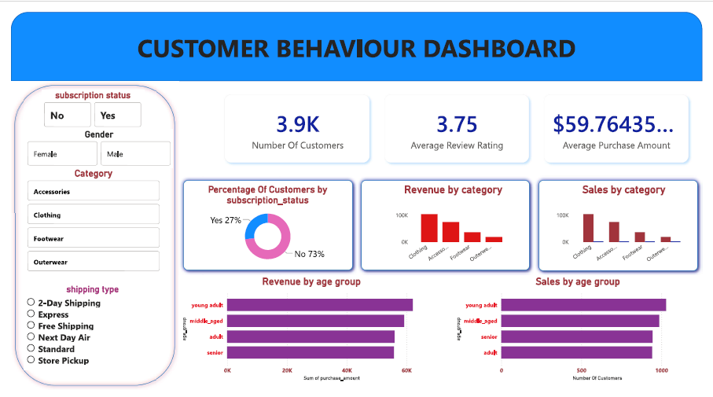

# Customer Shopping Behavior Analysis

## Project Overview
This project analyzes **customer shopping behavior** using transactional data from **3,900 purchases** across multiple product categories.  
The goal is to uncover insights into **spending patterns, customer segmentation, product preferences, and subscription behavior** to support **data-driven business decisions**.

The project demonstrates an **end-to-end data analytics workflow** using **Python for data preparation and EDA**, **MySQL for structured analysis**, and **Power BI for interactive dashboards**.

---

## Dataset Summary

- **Total Records:** 3,900  
- **Total Columns:** 18  

### Key Features
- **Customer Demographics**
  - Age  
  - Gender  
  - Location  
  - Subscription Status  

- **Purchase Details**
  - Item Purchased  
  - Product Category  
  - Purchase Amount  
  - Season  
  - Size  
  - Color  

- **Shopping Behavior**
  - Discount Applied  
  - Promo Code Used  
  - Previous Purchases  
  - Frequency of Purchases  
  - Review Rating  
  - Shipping Type  

- **Missing Data**
  - 37 missing values in the `review_rating` column

---

## Exploratory Data Analysis (EDA) – Python

EDA and data preparation were performed using **Python (pandas, NumPy)**.

### Key Steps
- Loaded data using `pandas`.
- Performed initial exploration with `df.info()` and `df.describe()`.
- Handled missing values in `review_rating` using **median imputation by product category**.
- Standardized column names to **snake_case**.
- Feature engineering:
  - Created `age_group` by binning customer ages.
  - Created `purchase_frequency_days` from purchase history.
- Identified redundancy between `discount_applied` and `promo_code_used` and removed `promo_code_used`.

---

## Database Integration & SQL Analysis (MySQL)

- Connected Python scripts to a **MySQL database**.
- Loaded the cleaned dataset into MySQL tables.
- Performed SQL analysis to answer key business questions:
  - Customer spending patterns and purchase frequency
  - Product category performance
  - Impact of discounts on sales
  - Subscription vs non-subscription customer behavior
  - Customer segmentation based on demographics and transactions

---

## Data Visualization – Power BI

- Connected **Power BI** to the MySQL database.
- Built interactive dashboards to visualize:
  - Customer demographics and segmentation
  - Purchase and category performance
  - Subscription and discount impact
  - Sales and behavioral trends
- Enabled dynamic filtering and drill-down analysis for business users.

---

## Dashboard Preview

### Customer Overview Dashboard

---

## Tools & Technologies Used

- **Python** (pandas, NumPy) – Data cleaning, EDA, feature engineering  
- **MySQL** – SQL-based business analysis  
- **Power BI** – Interactive dashboards and reporting  
- **Git & GitHub** – Version control and documentation  

